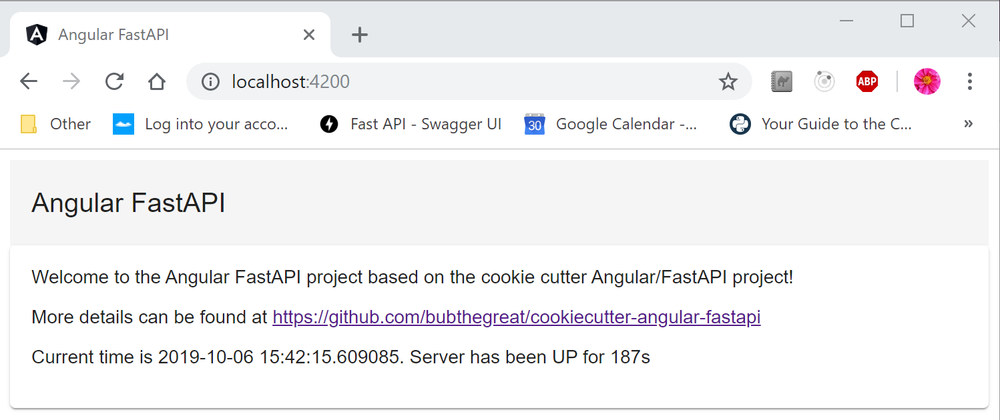

# Angular FastAPI
I use Angular and FastAPI for my personal projects, and I'm tired of setting them up from scratch, so here's the cookiecutter project that does it for me!  This will give you a basic cAngular frontend with a FastAPI backend.

It looks like this if we did it right!



## TODOS
* Implement authentication with JWT
* Implement security.

### Angular Frontend
The angular frontend has a few things already defined that should serve as good reference starting points:
* A service that leverages the backend API
* A status component that uses the backend service
* A home component that presents the status along with other information
* A routing config that leverages angular routing to display the components
* A generic toolbar in the main app html file
* A generic status interface that the service and components use for typing

### FastAPI Backend
The FastAPI backend currently is pretty simple - but it should be configured to be a good starting point for any API with:
* A fully pip installable configuration
* A requirements.txt that is easy to update
* A simple example API endpoint defined
* CORS middleware so you can do some default deployments without having to check hostnames for testing
* A main entrypoint for the app that leverages Uvicorn for production ready service performance

## How to use the template

This project requires nodejs 10.x+ and python3.7+, mostly because I don't want to maintain something older.  Get with the times people! :D

The most basic example of what this produces is at https://github.com/bubthegreat/angular-fastapi

You can look at that and see how the CI/CD jobs ran and how the project actually ended up generating.

1. Install cookiecutter

`pip install --user cookiecutter`

2. Make some cookies

`cookiecutter https://github.com/bubthegreat/cookiecutter-angular-fastapi`

3. Follow the prompts for the project name.  Right now it only supports python snake_case or it'll break the python packaging.

```
PS C:\Users\bubth\Development\test> cookiecutter https://github.com/bubthegreat/cookiecutter-angular-fastapi
You've downloaded C:\Users\bubth\.cookiecutters\cookiecutter-angular-fastapi before. Is it okay to delete and re-download it? [yes]:
project_name [Angular FastAPI]:
project_slug [angular-fastapi]:
angular_slug [app-angular-fastapi]:
python_slug [api_angular_fastapi]:
project_description [This is a basic Angular FastAPI implementation!]:
PS C:\Users\bubth\Development\test>
```

You should now see the project you made:

```
PS C:\Users\bubth\Development\test> ls
Directory: C:\Users\bubth\Development\test
Mode                LastWriteTime         Length Name
----                -------------         ------ ----
d-----        10/6/2019   1:47 AM                angular-fastapi
PS C:\Users\bubth\Development\test>
```

# Development with your new project

## Backend

Our API backend is FastAPI, which does automatic swagger docs for you!  Swagger docs will be available at http://{{cookiecutter.domain}}:{{cookiecutter.api_port}}/docs when running on your {{cookiecutter.domain}} so you can see what they look like.

### Installing the backend

```
(venv) PS C:\Users\bubth\Development\test\> cd .\angular-fastapi\api_angular_fastapi\
(venv) PS C:\Users\bubth\Development\test\angular-fastapi\api_angular_fastapi> python -m venv venv
(venv) PS C:\Users\bubth\Development\test\angular-fastapi\api_angular_fastapi> .\venv\Scripts\Activate.ps1
(venv) PS C:\Users\bubth\Development\test\angular-fastapi\api_angular_fastapi> pip install .
Processing c:\users\bubth\development\test\angular-fastapi\api_angular_fastapi

    *** SNIP INSTALLATION ***

(venv) PS C:\Users\bubth\Development\test\angular-fastapi\api_angular_fastapi>
```

### Running the backend

To run the backend API, you should be able to run the app.py:

```
(venv) PS C:\Users\bubth\Development\test\angular-fastapi\api_angular_fastapi> python .\test1_backend\app.py
INFO: Uvicorn running on http://0.0.0.0:{{cookiecutter.api_port}} (Press CTRL+C to quit)
INFO: Started reloader process [11436]
INFO: Started server process [2248]
INFO: Waiting for application startup.
```

If you navigate to http://{{cookiecutter.domain}}:{{cookiecutter.api_port}}/status you should get something similar to this:

`{"status":"UP","uptime":"52s","server_time":"2019-10-05 23:27:54.505806"}`


## Frontend

Our frontend is Angular, reachable at http://{{cookiecutter.domain}}:4200 when the test server is up - but deployments to production are beyond the scope of this cookiecutter template.

### Installing the frontend

```
PS C:\Users\bubth\Development\test> cd .\angular-fastapi\app-angular-fastapi\
PS C:\Users\bubth\Development\test\angular-fastapi\app-angular-fastapi\> npm install .
```

### Running the frontend

To run the frontend, you'll run the command:

`ng serve`

from the frontend directory.  If you navigate to http://{{cookiecutter.domain}}:4200 you should see a generic welcome page!  If you've started the backend first in the order it's described here, you should see a welcome page that pulls the backend server status and updates with some minor angular material styling.

